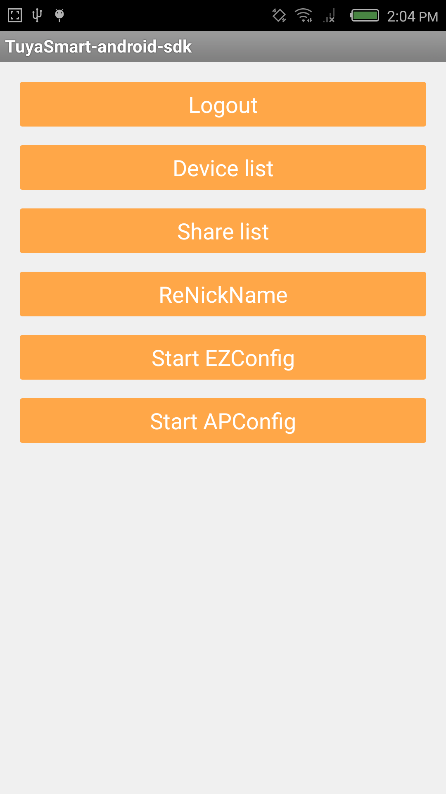
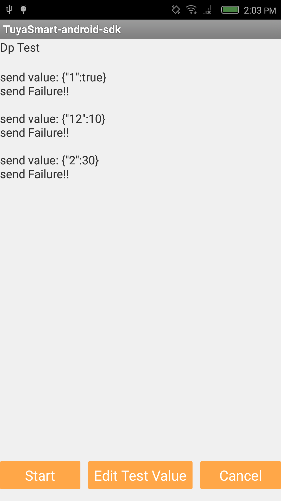
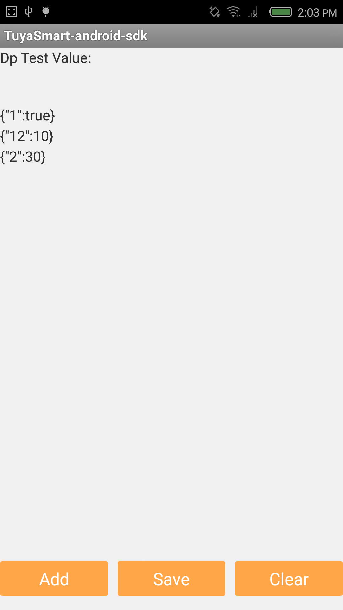
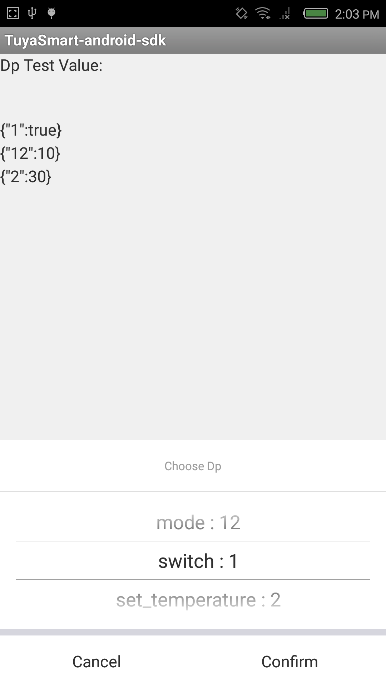

# 涂鸦智能Android SDK

---

## 功能概述
涂鸦智能SDK提供了与硬件设备、涂鸦云通讯的接口封装，加速应用开发过程，主要包括了以下功能：
*  硬件设备相关（配网、控制、状态上报、定时任务、群组、固件升级、共享）
*  账户体系（手机号、邮箱的注册、登录、重置密码等通用的账户功能）
*  消息中心
*  意见反馈
*  涂鸦云HTTP API接口封装

---

##TestDpData

### Click the button of "Device list"

### Click the item of device

### Click the button of "Start" which can start the dp value test.

### Click the button of  "Edit Test Value" which can edit the dp test.

### Click the button of "Add" which can add the test value.

## 开发文档
请参考:[涂鸦文档中心 - Android SDK使用说明](http://docs.tuya.com/develop/app-development/android-sdk/)

