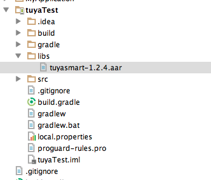

# 涂鸦智能Android SDK

---

## 功能概述
涂鸦智能SDK提供了与硬件设备、涂鸦云通讯的接口封装，加速应用开发过程，主要包括了以下功能：
*  硬件设备相关（配网、控制、状态上报、定时任务、群组、固件升级、共享）
*  账户体系（手机号、邮箱的注册、登录、重置密码等通用的账户功能）
*  消息中心
*  意见反馈
*  涂鸦云HTTP API接口封装

---

## 版本更新记录
### 1.7.4
* 三方Mqtt库迁移出来，底层库稳定性增加,升级时注意添加相关依赖，可参考demo build.gradle配置。
* 增加蓝牙mesh相关功能
* 针对分享进行了升级


### 1.5.11
* 修复定时接口传参有误的问题

### 1.5.10
* 修复安卓在低版本系统上崩溃的问题

### 1.5.9
* 修复安卓6.0、7.0个别手机兼容性问题。
* 修复一些空指针问题。
* 增强通信安全
* 第三方类库拆分出来，升级时注意添加相关依赖，可参考demo build.gradle配置。

### 1.4.6
* 修复个别设备出现非法请求的情况
* 修复异常若干

### 1.4.5
* 修复局域网连接问题

### 1.4.4
* 发布局域网搜索设备接口。

### 1.4.2
* 发布第三方登陆接口。

### 1.4.1
* IAddMemberCallback    void onSuccess(Integer shareId)  Integer 需要替换成Long。
* modifyMemberName(int **) 、removeMember(int **) int 需要替换成long 类型。
* Volley 去除。
* apache http server 替换成OKHttp3.0。
* 局域网通信优化。
* 退出接口崩溃bug 修复。

### 1.3.4
* 局域网通信不稳定问题修复
* 设备网络监听状态变化，导致设备显示离线。问题修复 IDevListener onNetworkStatusChanged();

### 1.3.2
* 修复只读dp无法上报问题

---

## 集成SDK
### 集成准备
#### （1）创建工程

	 在Android Studio中建立你的工程。

####（2）引入aar包

在工程中新建一个libs目录，将下载好的tuyasmart-xxxx.aar复制到该目录中（如下图所示，建立了一个名为tuyaTest的工程，并把aar包复制到libs目录下）。请前往[GitHub](https://github.com/TuyaInc/tuyasmart_android_sdk/tree/master/tuyaTest/libs)获取涂鸦智能Android SDK




####（3）build.gradle 配置

build.gradle 文件里添加如下配置

```
defaultConfig {
        ndk {
          abiFilters "armeabi-v7a","x86"
        }

gradle
repositories {
    flatDir {
        dirs 'libs'
    }
}
dependencies {
      compile(name: ‘tuyasmart-xxx’, ext: ‘aar')
      compile 'com.alibaba:fastjson:1.1.45.android'
      compile 'com.squareup.okhttp3:okhttp-urlconnection:3.2.0'
      compile 'de.greenrobot:eventbus:2.4.0'
      compile 'io.reactivex:rxandroid:1.2.1'

}


android {
      lintOptions {
        abortOnError false
        disable 'InvalidPackage'
    }

    compileOptions {
        sourceCompatibility JavaVersion.VERSION_1_7
        targetCompatibility JavaVersion.VERSION_1_7
    }
     packagingOptions {
        exclude 'META-INF/LICENSE.txt'
        exclude 'META-INF/NOTICE'
        exclude 'META-INF/LICENSE'
        exclude 'META-INF/NOTICE.txt'
        exclude 'META-INF/INDEX.LIST'
        exclude 'META-INF/services/javax.annotation.processing.Processor'
    }
}

```

#####【注意事项】

涂鸦智能sdk默认只支持armeabi-v7a和x86架构的平台，如有其他平台需要可前往[GitHub](https://github.com/TuyaInc/tuyasmart_android_sdk/tree/master/library)获取

####（4）AndroidManifest.xml 设置

在AndroidManifest.xml文件里配置appkey和appSecret，在配置相应的权限等

```
 <meta-data
            android:name="TUYA_SMART_APPKEY"
            android:value="应用id" />
 <meta-data
            android:name="TUYA_SMART_SECRET"
            android:value="应用密钥" />

添加必要的权限支持
    <!-- sdcard -->
    <uses-permission android:name="android.permission.WRITE_EXTERNAL_STORAGE" />
    <uses-permission android:name="android.permission.READ_EXTERNAL_STORAGE" />
    <uses-permission android:name="android.permission.READ_PHONE_STATE" />
    <!-- 网络 -->
    <uses-permission android:name="android.permission.INTERNET" />
    <uses-permission android:name="android.permission.CHANGE_NETWORK_STATE" />
    <uses-permission android:name="android.permission.CHANGE_WIFI_STATE" />
    <uses-permission android:name="android.permission.ACCESS_NETWORK_STATE" />
    <uses-permission android:name="android.permission.ACCESS_WIFI_STATE" />
    <uses-permission android:name="android.permission.WAKE_LOCK" />

添加必要的service和receiver
  <service android:name="org.eclipse.paho.android.service.MqttService" />

        <receiver android:name="com.tuya.smart.android.base.broadcast.NetworkBroadcastReceiver">
            <intent-filter>
                <action android:name="android.net.conn.CONNECTIVITY_CHANGE" />
            </intent-filter>
        </receiver>

        <service
            android:name="com.tuya.smart.android.hardware.service.GwBroadcastMonitorService"
            android:exported="true"
            android:label="UDPService"
            android:process=":monitor">
            <intent-filter>
                <action android:name="tuya.intent.action.udp" />

                <category android:name="tuya" />
            </intent-filter>
        </service>
        <service
            android:name="com.tuya.smart.android.hardware.service.GwTransferService"
            android:exported="true"
            android:label="TCPService"
            android:process=":transfer">
            <intent-filter>
                <action android:name="tuya.intent.action.tcp" />

                <category android:name="tuya" />
            </intent-filter>
        </service>

```

###初始化SDK
####(1) 配置appKey 和appSercet
联系我们获取appKey 和 appSercet 设置到xml里。

```
    <meta-data
            android:name="TUYA_SMART_APPKEY"
            android:value=""/>

    <meta-data
            android:name="TUYA_SMART_SECRET"
            android:value=""/>
```

####(2) Application中初始化涂鸦智能sdk。
#####【描述】

    主要用于初始化EventBus、通信服务等组件。

#####【代码范例】

```
public class TuyaSmartApp extends Application {

    @Override
    public void onCreate() {
        super.onCreate();
        TuyaSdk.init(this);
    }
}
```

#####【注意事项】

    appId和appSecret需要配置AndroidManifest.xml文件里，或者在build环境里配置，也可以在代码里写入。
####(3)  注销涂鸦智能云连接
在退出应用或者退出登陆的时候调用以下接口注销掉。

```

TuyaUser.getDeviceInstance().onDestroy();

```

####(4)  注册session失效监听
#####【描述】

    Session由于可能存在一些异常或者在一段时间不操作（45天）会失效掉，这时候需要退出应用，重新登陆获取Session。

#####【方法调用】

```
//session失效监听
TuyaSdk.setOnNeedLoginListener(INeedLoginListener needLoginListener);
```
#####【实现回调】

```
needLoginListener.onNeedLogin(Context context);
```
#####【代码范例】

```
TuyaSdk.setOnNeedLoginListener(new INeedLoginListener() {
     @Override
     public void onNeedLogin(Context context) {

     }
});
```
【注意事项】

* 一旦出现此类回调，请跳转到登陆页面，让用户重新登陆。

---

## 涂鸦SDK 演示程序

[演示程序](http://fir.im/androidSDKDemo)


## 开发文档
请参考:[涂鸦文档中心 - Android SDK使用说明](http://docs.tuya.com/develop/app-development/android-sdk/)


